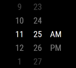
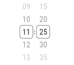
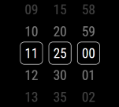
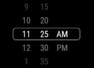
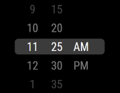
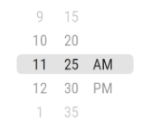
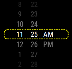

# Timeless Picker
## About

Timeless Picker is an out-of-the-box, highly-customizable, infinite wheel (time) picker for Angular
applications.

#### Demo can be found here: [insert link]

The main goal of this project is to provide a general-purpose *infinite*-scroll wheel picker
(ios-style), with a larger focus on time-pickers. I couldn't find any free infinite-scroll
time pickers for Angular, so I decided to create one. And although there already exist
general infinite-scroll packages, they however use lazy-loading techniques, which keep dynamically
adding new elements to the DOM. This has many possible downsides, among which is
decreased performance.

This project, on the other hand, mocks scrolling mathematically and programmatically, without
adding any dynamically adding any new elements.

### Getting started
Install the package:
```shell
npm i --save timeless-picker
```

And this dependency:
```shell
npm i --save hammerjs
```

You may have to also install the following (you will get Type errors if you have
`"noImplicityAny: true"` set under `"compilerOptions"` in your project's `tsconfig.json`):
```shell
npm i --save-dev @types/hammerjs
```

Import the package's styles by adding the following to your global/main styles file:
```scss
@import "../node_modules/timeless-picker/src/scss/global";
```

Import `TimelessPickerModule` into your `app.module.ts`:
```typescript
import { NgModule } from '@angular/core';
import { BrowserModule } from '@angular/platform-browser';

import { AppRoutingModule } from './app-routing.module';
import { AppComponent } from './app.component';
import { TimelessPickerModule } from 'timeless-picker';


@NgModule({
  declarations: [
    AppComponent
  ],
  imports: [
    TimelessPickerModule,
    BrowserModule,
    AppRoutingModule
  ],
  providers: [],
  bootstrap: [AppComponent]
})
export class AppModule { }
```

### Components

1) Base-picker: can be used in any situation where you need to display options for selection in
   a scrollable wheel style.


2) Time-picker: you can build with it any time-selection component with any format and several
   built-in styling options. It can also be flexibly customized beyond what's provided.

# How to use?

## Base-Picker:
### Usage:
*Required parameters:*
- displayData
- newSelectedIndex

```angular2html
<timeless-base-picker
 [displayData]=yourInputDataArray
 (newSelectedIndex)=newSelectionEvent($event)>
</timeless-base-picker>
```

You must provide an array of data to display as options. And you have to handle the event of new
selection. For all the possible properties and settings, see the table below.


### Input Properties

| Property                                                             | Input type                                                         | Default value    | Purpose                                                                                                                                                                                                                                                                                             |
|----------------------------------------------------------------------|--------------------------------------------------------------------|------------------|-----------------------------------------------------------------------------------------------------------------------------------------------------------------------------------------------------------------------------------------------------------------------------------------------------|
| <span style="color: #ffd480;">***General configurations***</span>    | <br/>                                                              |                  |                                                                                                                                                                                                                                                                                                     |
| infiniteWheelStyle                                                   | boolean                                                            | true             | An infinite wheel (true) means that items can be scrolled in an infinite loop. Otherwise (false), it's a picker bounded by itsfirst and last items.                                                                                                                                                 |
| size                                                                 | string: 'xsmall',<br>'small',<br>'medium',<br>'large',<br>'xlarge' | 'medium'         | The size of the picker. If you wish to customize the size, see this [add link].                                                                                                                                                                                                                     |
| enableOpacity                                                        | boolean                                                            | true             | Adds a gradient (fading) opacity for the items before and after the middle item. This creates the curvature illusion of a wheel.                                                                                                                                                                    |
| addBorder                                                            | boolean                                                            | false            | Draw a box around the middle (selected) element of each picker. The selected element is already highlighted due to the opacity effect, but this is an alternative/additional way to highlight the selection. (See example pictures). You can also add your own custom border (see [ADD REFERENCE]). |
| <span style="color: #ffd480;">***Data handling and display***</span> |                                                                    |                  |                                                                                                                                                                                                                                                                                                     |
| visibleItemsCount                                                    | number:<br> 3 &#124; 5 &#124; 7 &#124; 9                           | 7                | How many items are displayed on the wheel/picker. Must be odd so that the selection is in the middle of the wheel. The range restriction is for aesthetics purposes.                                                                                                                                |
| displayData                                                          | string[  ]                                                         | empty array: [ ] | A list of the data to display, ordered relatively - i.e. items ordered relative to each other, and not necessarily according to how they are displayed on the wheel.                                                                                                                                |
| selectedItemIndex                                                    | number                                                             | 0                | The index of the item the user wishes to display in the middle upon initialization. The indexof the item within the displayData list. E.g.: [a,b,c,d,e] -> 1 displays item b in the middle.                                                                                                         |
| <span style="color: #ffd480;">***Controls***</span>                  |                                                                    |                  |                                                                                                                                                                                                                                                                                                     |
| enableMouseWheel                                                     | boolean                                                            | false            | Enables scrolling using the mouse wheel when the cursor is hovering over the picker (relevant only for web apps).                                                                                                                                                                                   |

### Output Events

| Event            | Value type | Purpose                                                                                                                                                                                                                                                   |
|------------------|------------|-----------------------------------------------------------------------------------------------------------------------------------------------------------------------------------------------------------------------------------------------------------|
| newSelectedIndex | number     | This returns the index (in the input data list) of the selected value, upon any change in the selection. It's important to note that this is NOT the value of the selected element, but its position. You have to index your input data to get the value. |


## Time-picker:
### Usage:

*Required parameters:*
 *** todo ***

```angular2html
<timeless-time-picker
 [hourFormat]=chooseHourFormat
 [startTime]=specifyStartTime
 (timeChangeIso)=newTimeEvent($event)>
</timeless-time-picker>
```

This is just one simple example of how to use the time picker. Consult the table below for a
more detailed overview of all the possible properties and customizations. Note that there are
two events for changes in time selection (ISO or simple string), you can use whatever suits you
best.

### Input Properties

| Property                                                                         | Input type                                                          | Default value      | Purpose                                                                                                                                                                                                                                                                                       |
|----------------------------------------------------------------------------------|---------------------------------------------------------------------|--------------------|-----------------------------------------------------------------------------------------------------------------------------------------------------------------------------------------------------------------------------------------------------------------------------------------------|
| <span style="color: #ffd480;">***General style configurations***</span>          |                                                                     |                    |                                                                                                                                                                                                                                                                                               |
| theme                                                                            | string: 'dark' &#124; 'light'                                       | 'light'            | General theme of the entire component. (You can provide your own custom theme - see [ADD REFERENCE])                                                                                                                                                                                          |
| customLightTheme                                                                 | Partial<Theme> (see [REFERENCE] for more information)               | Default lightTheme | A customized (full or partial) theme to substitute the default light theme. The light theme is component's default, so if you wish to change the default (and not the dark theme), you only have to provide this value.                                                                       |
| customDarkTheme                                                                  | Partial<Theme> (see [REFERENCE] for more information)               | Default darkTheme  | A customized (full or partial) theme to substitute the default dark theme.                                                                                                                                                                                                                    |
| size                                                                             | 'xsmall',<br>'small',<br>'medium',<br>'large',<br>'xlarge'          | 'medium'           | The size of the picker. If you wish to customize the size, see this [add link].                                                                                                                                                                                                               |
| <span style="color: #ffd480;">***Selection box/highlight configuration***</span> |                                                                     |                    |                                                                                                                                                                                                                                                                                               |
| selectionHighlightStyle                                                          | string: 'spanning' &#124; 'separate' &#124; 'none'       <br/>      | 'none'             | The 'spanning' style adds a box or highlighted rectangle (based on other parameters explained below) that spans over all the selected elements across the multiple pickers. On the other hand, the 'separate' style draws an individual box around the selected item for each of the pickers. |
| selectionBoxBorder                                                               | boolean                                                             | true               | Draws a border around the selection box.                                                                                                                                                                                                                                                      |
| selectionBoxBackground                                                           | boolean                                                             | true               | Adds a background color to the selection box.                                                                                                                                                                                                                                                 |
| showDivider                                                                      | boolean                                                             | false              | Adds a colon (:) between the time pickers as a divider.                                                                                                                                                                                                                                       |
| <span style="color: #ffd480;">***Time format configurations***</span>            |                                                                     |                    |                                                                                                                                                                                                                                                                                               |
| hourFormat                                                                       | string: 'hours24' &#124; 'hours12'                                  | 'hours24'          | Choose between a 24-hour and 12-hour format. A 12-hour format automatically adds another picker for AM/PM.                                                                                                                                                                                    |
| showSeconds                                                                      | boolean                                                             | false              | Adds a picker for seconds (the default only shows hours and minutes).                                                                                                                                                                                                                         |
| visibleItemsCount                                                                | number:<br> 3 &#124; 5 &#124; 7 &#124; 9                            | 7                  | How many items are displayed on the wheel/picker. Must be odd so that the selection is in the middle of the wheel. The range restriction is for aesthetics purposes.                                                                                                                          | 
| startTime                                                                        | string                                                              | '11:25:00'         | You can choose to provide either an 1) ISO string for the starting time selection (what will be displayed in the middle of the wheel) or 2) a simple string format 'HH:mm:ss'. The appropriate format will be detected automatically, so you don't have to worry about any conversions.       |
| minuteStep                                                                       | number:<br> 1 &#124; 5 &#124; 10 &#124; 15 &#124;<br/> 20 &#124; 30 | 1                  | Shows the minute values that are a multiple of the chosen number. E.g. if you want to restrict the minutes options for quarters of an hour, set the value to 15.                                                                                                                              |

### Output Events

| Event             | Value type | Purpose                                                                                                                        |
|-------------------|------------|--------------------------------------------------------------------------------------------------------------------------------|
| timeChangeIso     | string     | Broadcasts the new time selection in ISO format. (Both ISO and simple string format are always provided).                      |
| timeChangeSimple  | string     | Broadcasts the new time selection in a simple string format 'HH:mm:ss' (if showSeconds = false, seconds is always equal to 0). |


## A deeper insight into customizations

### Selection highlight

The default picker has a gradient opacity effect applied to the elements before and after the
middle (or selected) one. This serves to highlight the selected element and to produce an effect
of a curved wheel.



Additionally, the package includes two different styles of selections boxes, as shown below:
1) `Separate` style: individual boxes around each picker's selection:*




2) `Spanning` style: one rectangular shape that spans over multiple pickers (this doesn't apply
   if you're using one base-picker. This option is available for the time-picker or if you're
   using the timeless-container template [REFERENCE NEEDED] to host multiple base-picker):*





*The examples aren't comprehensive with regard to available styling.

#### Custom selection highlight component:

It's also possible to provide your own custom selection box/highlight component.

If you're using the out-of-box `timeless-time-picker`, you can provide a custom component as a
child by annotating it with the selector `custom-selection-highlight`. Here's an example:

```angular2html
<timeless-time-picker [hourFormat]="'hours12'" [visibleItemsCount]="7" [theme]="'dark'">
      <div class="custom-selection" custom-selection-highlight></div> 
</timeless-time-picker>
```
```css
.custom-selection {
  z-index: 10;
  position: absolute;
  height: calc(100% / 8);
  width: 100%;
  border-radius: 12px;
  border-width: 3px;
  border-style: dashed;
  border-color: yellow;
}
```
*make sure to add `z-index: 10` to stack the box below the time-picker component in order not to
interfere with the scroll/pan recognition and `position: absolute` to allow stacking.

The above code will give the produce the following result:


